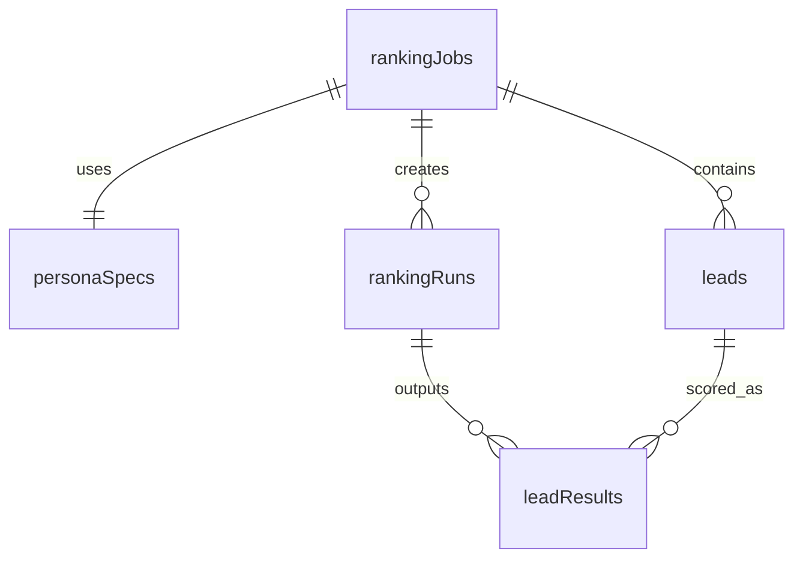

# Persona Ranker Implementation Plan

## Current State

The project already has a working Next.js 16 scaffold with:

- **Drizzle ORM + Postgres** connected via `DATABASE_URL` ([src/db/index.ts](src/db/index.ts))
- **AI SDK** with OpenRouter/Gemini via `AI_API_KEY` ([app/api/chat/route.ts](app/api/chat/route.ts))
- **shadcn/ui** (radix-lyra style, Phosphor icons) with button component
- **Better Auth** (email/password) with dashboard/sign-in pages
- A demo `usersTable` and chat page that will be replaced

No CSV files or persona spec exist in the repo yet — they need to be downloaded from the provided Google Sheets links.

---

## Phase 1: Foundation (Schema + Assets + Cleanup)

### 1.1 Download assets

- Fetch `leads.csv` (~200 leads) and `persona_spec.md` from the Google Sheets links in the PDF
- Place them in a `data/` directory at project root for reference and seeding

### 1.2 Replace DB schema

- Remove the demo `usersTable` from [src/db/schema.ts](src/db/schema.ts)
- Implement the 5-table schema from the notes:

- `**ranking_jobs**` — `id (uuid)`, `status (text)`, `created_at`
- `**persona_specs**` — `id (uuid)`, `ranking_job_id (fk)`, `raw_input (jsonb)`, `normalised_rules (jsonb)`
- `**leads**` — `id (uuid)`, `ranking_job_id (fk)`, `raw_row (jsonb)`, `normalised_name`, `normalised_title`, `normalised_company`, `normalised_function`, `normalised_seniority`, `linkedin_url`
- `**ranking_runs**` — `id (uuid)`, `ranking_job_id (fk)`, `method (text: "hard_rules" | "hard_rules_llm")`, `created_at`
- `**lead_results**` — `id (uuid)`, `ranking_run_id (fk)`, `lead_id (fk)`, `qualified (bool)`, `score (int)`, `persona_role (text)`, `company_rank (int)`, `rejection_reason (text)`
- Run `drizzle-kit generate` + `drizzle-kit push` to apply

### 1.3 Clean up scaffold

- Remove the demo chat page content from [app/page.tsx](app/page.tsx) — replace with the ranker UI
- Remove [app/api/chat/route.ts](app/api/chat/route.ts) (no longer needed)
- Remove the demo `src/index.ts` script
- Keep auth, dashboard, and sign-in pages as-is (they're not in the way)

---

## Phase 2: Backend Pipeline

The ranking pipeline lives in a `lib/pipeline/` directory with clear separation of concerns.

### 2.1 CSV parser (`lib/pipeline/parse-csv.ts`)

- Parse CSV text into an array of key-value objects
- Handle flexible column names (the spec says input structure is not fully defined)
- Validate that at minimum `name` and `company` columns exist (or close variants)

### 2.2 Persona normalisation (`lib/pipeline/normalise-persona.ts`)

- Takes raw persona text (from uploaded file or pasted text)
- Calls the LLM with a structured output schema (Zod) to extract:
  - `includeFunctions: string[]`
  - `excludeFunctions: string[]`
  - `minimumSeniority: string`
  - `preferredTitles: string[]`
  - `preferredPersonaRoles: string[]`
- Uses `generateObject` from the AI SDK for reliable structured extraction
- Stores both `raw_input` and `normalised_rules` in the `persona_specs` table

### 2.3 Lead normalisation (`lib/pipeline/normalise-leads.ts`)

- Takes parsed CSV rows + normalised persona spec
- Batch-calls the LLM (or uses deterministic heuristics where possible) to map each raw row to:
  - `normalised_name`, `normalised_title`, `normalised_company`
  - `normalised_function` (inferred department: Sales, HR, Engineering, etc.)
  - `normalised_seniority` (inferred level: IC, Manager, Director, VP, C-Suite)
  - `linkedin_url`
- Stores results in the `leads` table
- Strategy: batch leads in groups (~20-30 per LLM call) to reduce cost and latency

### 2.4 Hard-rules engine (`lib/pipeline/hard-rules.ts`)

- Takes normalised leads + normalised persona rules
- Applies three filters sequentially:
  1. **Include functions** — keep only leads whose `normalised_function` is in the include list
  2. **Exclude functions** — remove leads whose `normalised_function` is in the exclude list
  3. **Minimum seniority** — remove leads below the seniority threshold
- Leads that fail a filter get `qualified: false` with a `rejection_reason`
- Surviving leads get a deterministic score based on title match and seniority weight
- Rank within company, apply top-N-per-company cap
- Write results to `lead_results` via a `ranking_run` with `method: "hard_rules"`

### 2.5 LLM ranking engine (`lib/pipeline/llm-rank.ts`)

- Takes the same hard-rule-filtered leads + normalised persona spec
- Sends batches to the LLM with a prompt that asks it to:
  - Score each lead 0-100 based on persona fit
  - Classify persona role (Buyer, Influencer, Operator)
  - Determine qualification (contact or not)
- Uses `generateObject` with a Zod array schema for structured output
- Rank within company, apply top-N-per-company cap
- Write results to `lead_results` via a `ranking_run` with `method: "hard_rules_llm"`

### 2.6 Job orchestrator API (`app/api/rank/route.ts`)

- `POST /api/rank` — accepts `FormData` with CSV file + persona spec text/file
- Orchestrates the full pipeline:
  1. Create a `ranking_job` with status `"processing"`
  2. Parse CSV
  3. Normalise persona spec
  4. Normalise leads
  5. Run hard-rules-only approach
  6. Run hard-rules + LLM approach
  7. Update job status to `"completed"`
- Returns the `ranking_job.id` for the frontend to poll/fetch results

### 2.7 Results API (`app/api/rank/[jobId]/route.ts`)

- `GET /api/rank/:jobId` — returns job status, both ranking runs, and their lead results
- Used by the frontend to poll for completion and fetch final data

---

## Phase 3: Frontend

### 3.1 Main page ([app/page.tsx](app/page.tsx))

- Two upload zones:
  - **Leads CSV** — file drag-and-drop / file picker (accepts `.csv`)
  - **Persona spec** — file drag-and-drop / text area (accepts `.md` / `.txt` or free-form text)
- A "Start Ranking" button that POSTs to `/api/rank`
- Loading state with progress indication while the job runs

### 3.2 Results table

- Install **TanStack Table** (`@tanstack/react-table`) for the data table
- Add shadcn `table`, `badge`, `tabs`, `card` components
- Two tabs: "Hard Rules Only" and "Hard Rules + LLM" for side-by-side comparison
- Columns:
  - Qualified (badge: green/red)
  - Score (0-100)
  - Company Rank
  - Persona Role (LLM tab only)
  - Name, Title, Company, LinkedIn
  - Rejection Reason (for disqualified leads)
- Sortable by score column (bonus: sortable by any column via TanStack)

### 3.3 CSV export

- "Export CSV" button below each results tab
- Generates a CSV file in the browser from the table data
- Includes all columns: qualification, score, rank, original fields

---

## Phase 4: Polish and Deploy

### 4.1 Error handling

- Graceful failures if persona normalisation or lead normalisation fails (as noted: "fail the whole process")
- Toast notifications for errors
- Input validation (empty CSV, missing columns, etc.)

### 4.2 README

- How to run locally (env vars, db setup, `bun install`, `bun dev`)
- Architecture overview (pipeline diagram from notes)
- Key decisions (hard rules vs LLM comparison, batched LLM calls, structured output)
- Tradeoffs (binary qualification, no ML model, cost considerations)

### 4.3 Deploy to Vercel

- Ensure `DATABASE_URL` and `AI_API_KEY` are set in Vercel env vars
- Verify the build succeeds and the app works end-to-end

---

## Key Technical Decisions

- **AI SDK `generateObject`** with Zod schemas for all LLM calls — guarantees structured output, no parsing errors
- **OpenRouter + Gemini** (already configured) — cost-effective for batch normalisation/ranking
- **Batched LLM calls** for lead normalisation/ranking — reduces API calls from 200 to ~7-10
- **Two ranking methods stored separately** — clean comparison without data pollution
- **TanStack Table** — recommended by the spec, handles sorting/filtering natively
- **No auth required for the ranking flow** — auth exists but the main ranking page is public (keep it simple)

