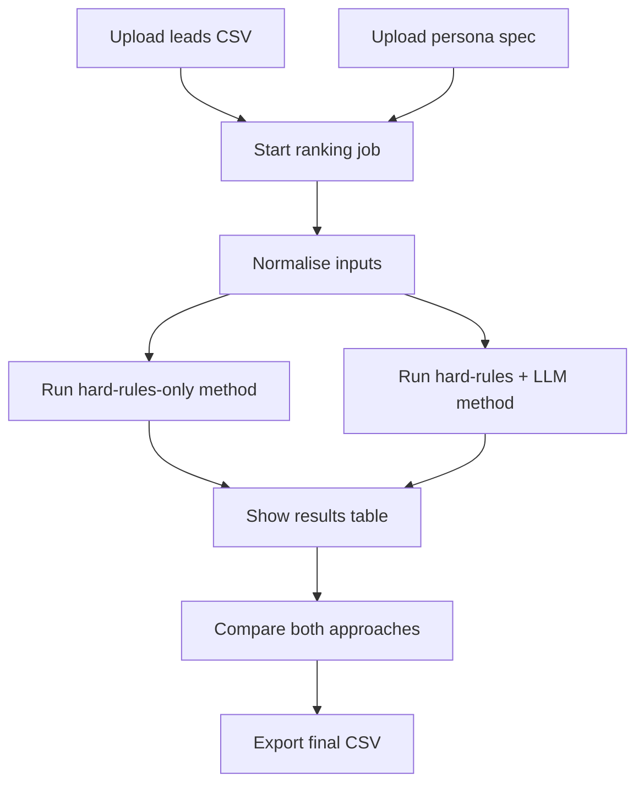
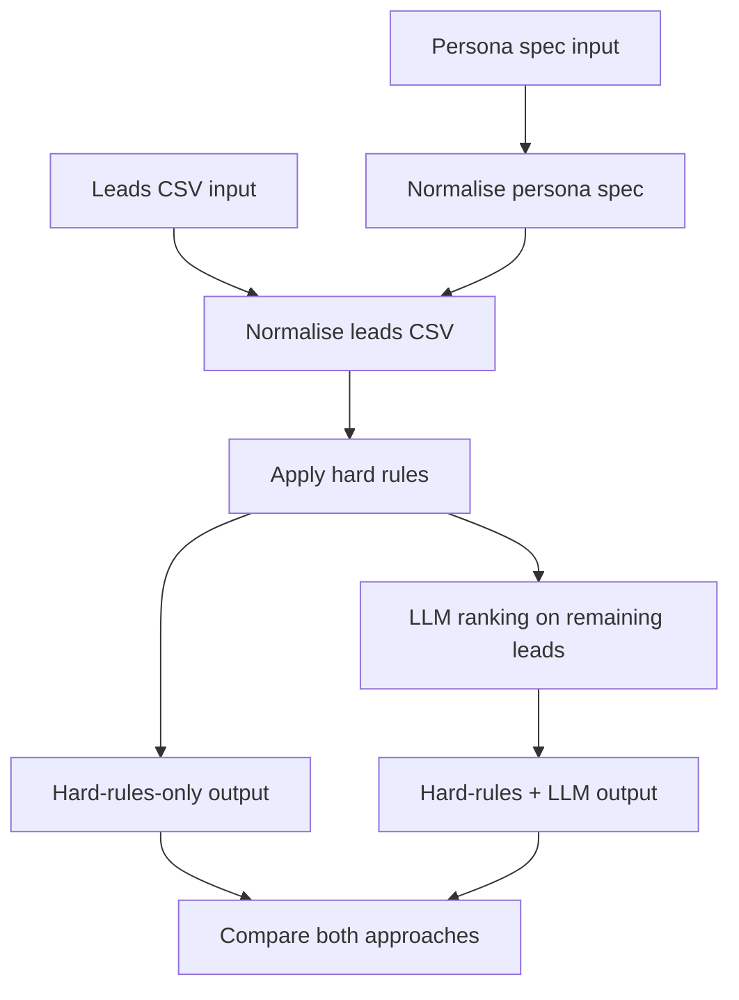
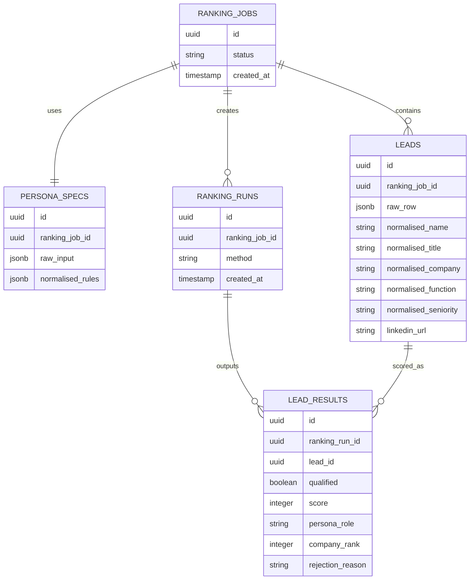

# Notes

## Plan

**Problem:** Given a list of people from target companies, return an ordered and qualified list of ranked people based on an ideal customer persona.

**Solution:** A website that takes a CSV of leads (`name`, `title`, `company`, `linkedin`) and a persona spec for who we do and do not want to contact, then returns a ranked and qualified list of people to contact.

**Constraints**

- Must use Next.js, Postgres, and Vercel

**Edge cases**

- The input structure for the CSV of leads is flexible and not fully defined
- The input structure for the persona spec is flexible and not fully defined

## Solution

- How the app will work?
  - Show screen with 2 inputs of drag n drop for the csv of leads and persona spec
  - Click button below the 2 inputs that will begin the ranking and qualifying
  - Show loading screen while pending for result
  - Show a table of the leads with columns with the first column being qualified (either false or true), then the column with score (0 - 100) ordered descending, and the rest of the columns that were provided in the original csv
  - Have a button to export this new csv file from the table under the table

- How we will rank the entries?
  - High-level flowchart

    ```mermaid
    flowchart TD
      A[Persona spec input] --> B[Normalise persona spec]
      C[Leads CSV input] --> D[Normalise leads CSV]
      B --> D
      D --> E[Apply hard rules]
      E --> F1[Hard-rules-only output]
      E --> F2[LLM ranking on remaining leads]
      F2 --> G[Hard-rules + LLM output]
      F1 --> H[Compare both approaches]
      G --> H
    ```

  - Details below the flowchart

  - Normalise the persona spec first
    - Use an LLM to convert the raw persona input into a fixed structure that the rest of the pipeline can use
    - The output should always be a consistent schema, even if the user gives free-form text
    - The normalised persona spec should look like this:

      | Rule area | Value |
      | --- | --- |
      | Include functions | Sales, RevOps, Sales Ops |
      | Exclude functions | HR, Recruiting, Legal, Finance |
      | Minimum seniority | Manager+ |
      | Preferred titles | VP Sales, Head of RevOps, Sales Ops Director |
      | Preferred persona roles | Buyer, Influencer, Operator |

    - This structure is how I will actually use the persona spec in the system:
      - **Include functions:** hard filter for which departments can be considered at all
      - **Exclude functions:** hard filter for departments that should always be removed
      - **Minimum seniority:** hard filter for who is senior enough to matter
      - **Preferred titles:** soft ranking signal that increases score if title closely matches
      - **Preferred persona roles:** soft ranking signal that helps the LLM classify whether the person is likely a buyer, influencer, or operator

  - Normalise the input leads CSV second
    - Map the raw CSV into a consistent internal format
    - Use the normalised persona spec as input when cleaning and interpreting each lead
    - Apply hard rules first:
      - **1. Relevant function only**
        - **Restricts:** who can be considered at all
        - **Change from:** all employees at a target company -> only employees in target functions
        - **Why:** stops you contacting irrelevant people just because they work there
      - **2. Exclude non-target functions**
        - **Restricts:** departments that are always out of scope
        - **Change from:** any company contact -> no HR, recruiting, legal, finance, etc.
        - **Why:** prevents "best available bad lead" problems
      - **3. Minimum seniority / influence**
        - **Restricts:** how junior a lead can be
        - **Change from:** all relevant-function employees -> only people with enough influence to matter
        - **Why:** avoids wasting outreach on contacts unlikely to buy, own, or influence the tool
    - From here, branch into two approaches so I can compare methods:
      - **Approach 1: Hard rules only**
        - Use only the filtered leads after applying the hard rules
        - Rank them with deterministic logic only, with no additional LLM ranking layer
      - **Approach 2: Hard rules + LLM**
        - Use the same filtered leads as input to the LLM stage
        - Pass the normalised persona spec and the cleaned lead data into the prompt
        - Ask the model to infer fit, likely persona role, and ranking score from aggregated / raw lead data
        - Use `Preferred titles` and `Preferred persona roles` as scoring guidance, not strict filters
    - Then rank the surviving leads within each approach so the final results can be compared on the same input set:
      - **4. Rank within company only**
        - **Restricts:** how ranking is calculated
        - **Change from:** one global rank across all leads -> separate rank per company
        - **Why:** the goal is to find the best contacts at each company, not the best people in the whole dataset
      - **5. Top N only**
        - **Restricts:** how many leads are surfaced per company
        - **Change from:** all relevant ranked leads -> only the top N per company
        - **Why:** keeps campaigns focused and avoids over-contacting one account

  - Show the final output last
    - Return two outputs for comparison:
      - hard-rules-only result
      - hard-rules + LLM result
    - Each output should keep the same CSV structure plus the generated qualification and ranking fields
    - This makes it easier to compare precision, ordering, and usefulness between both approaches

  - If the persona spec normalisation fails or the leads CSV normalisation fails, fail the whole process

- How should we store the data?

- Nice to haves / out of scope
  - See the loading based on each step of pipeline (SSE needed for this)

## Notes for architecture overview

### User journey



### Ranking algorithm flowchart



### Ranking inputs and outputs

- **Inputs**
  - Leads CSV uploaded by the user
  - Persona spec uploaded by the user

- **Normalised internal format**
  - Persona spec is converted into a stable rule structure
  - Leads CSV is converted into a stable internal schema while preserving the original uploaded fields

- **Outputs**
  - Hard-rules-only result set
  - Hard-rules + LLM result set
  - Final UI table showing qualification, score, and ranking
  - Exported CSV for the selected result set

### DB schema diagram



## Notes for key decisions taken

### What I will do

- Try with LLM only ranking / qualifying and comparing with results with a small pre-defined sets of hard rules
- I will allow the person to be able to have different toggles for sorting by score  

### What I did

- How to handle the actual inputs of the user, it was specified that the inputs are non-deterministic so I had to include a non-deterministic approach to using that data in order to create the ranking system
- Had to make the decision of how qualify my results, either binary or bucketed
- Make a small set of predefined rules to easily rule out the leads
- I first tried with the LLM to see its results compared with a mix

## Tradeoffs I took

- I wanted to include a bucketed result for the qualifiation, instead of just binary. But because of time constraints I only stuck to using binary yes or no because the question specified to make a decicision of whether to contact them or not, having a binary label whether it's fully supported or not if you assume to trust it is bring you to make the decision of not contacting a person much faster then inferring
- I did not use a ML model, even pre built, because it would take too much time in order to reliably integrate with this system. While it would greatly improve my results, the problem is the input, as the input needs to be normalised for the system and to debug with this take more time than it would to use an LLM. So in this case I decided to use a mix of hard rules and inferring from the LLM as the final solution
